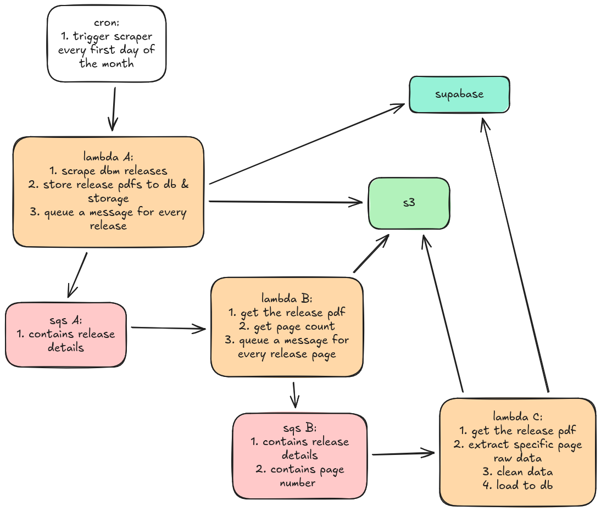

# DBM NCA Data Pipeline

A serverless ETL (Extract, Transform, Load) pipeline designed to automate the scraping, processing, and storage of Notice of Cash Allocation (NCA) documents from the Philippine Department of Budget and Management (DBM).

This project focuses exclusively on the **ingestion layer**: it autonomously monitors the DBM website and populates a **Supabase** database.

## 🚀 Key Features

* **Serverless Architecture:** Fully serverless execution using **AWS Lambda** to minimize idle costs and scale automatically.
* **Clean Architecture:** Domain logic is isolated from external frameworks, making the core code testable and portable.
* **Granular Parallelism (Fan-Out):** Implements a "Page-Level" processing strategy. Large PDFs are logically split into individual pages, allowing hundreds of pages to be processed in parallel rather than sequentially.
* **Resilient Queuing:** Uses **two stages of AWS SQS** (Release Queue & Page Queue) to decouple scraping, orchestration, and extraction.
* **Adaptive Table Parsing:** Dynamically handles **changing column layouts** within the PDF files using `pdfplumber` and `pandas`.

## 🏗️ Architecture

The pipeline follows a **Fan-Out / Worker** pattern to handle high-volume document processing:



### Data Flow Breakdown

1. **Ingestion (Lambda A):**
* Triggered by a scheduled event (Cron) or *manually*.
* Scrapes the DBM website for new NCA releases.
* Uploads the raw PDF to **S3**.
* Pushes a message containing the `release details` and metadata to **SQS A**.


2. **Orchestration (Lambda B):**
* Triggered by **SQS A**.
* Downloads the PDF from S3 to determine the total page count.
* **Fan-Out:** Loops through the page count and pushes a unique message for *every single page* to **SQS B**.


3. **Extraction (Lambda C):**
* Triggered by **SQS B**.
* Downloads the PDF but processes *only* the specific page assigned to it.
* Extracts the table data, handles column mapping, and cleans the data using `pandas`.
* Inserts the structured rows directly into **Supabase**.


## 🛠️ Tech Stack

### Core Logic


* **Language:** Python 3.14+
* **Data Processing:** Pandas, NumPy, pdfplumber
* **Architecture:** Clean Architecture (Domain-Driven Design)

### Infrastructure (AWS)


* **Compute:** AWS Lambda (3 Functions: Scraper, Splitter, Worker)
* **Storage:** AWS S3 (Raw Data Lake)
* **Messaging:** AWS SQS (Standard Queues)

### Database


* **Primary DB:** Supabase (PostgreSQL)

## 📂 Project Structure

```bash
.
├── handlers/                               # AWS Lambda Entry Points (Interface Layer)
│   ├── releases_scraper_and_publisher.py   # Lambda A: Scrapes DBM, saves to S3, pushes to SQS A
│   ├── release_pages_publisher.py          # Lambda B: Downloads PDF, counts pages, Fan-Out to SQS B
│   └── release_page_processor_and_loader.py # Lambda C: Extracts table from single page, loads to Supabase
│
├── src/                                    # Application Core (Framework Agnostic)
│   ├── core/                               # Inner Layer (Business Rules)
│   │   ├── entities/                       # Data models
│   │   ├── use_cases/                      # Application logic
│   │   └── interfaces/                     # Abstract base classes (Ports)
│   │
│   └── infrastructure/                     # Outer Layer (External Systems)
│       ├── adapters/                       # Implementations of interfaces
│       ├── config.py                       # Environment variable management
│       └── constants.py                    # App-wide constants
│
├── main.py                                 # Local execution entry point (for dev/debugging without AWS)
├── requirements.txt                        # Main project dependencies
└── supabase_schema.sql                     # Database initialization script

```

## 📦 Installation

Follow these steps to set up the project locally.

1. **Clone the repository:**
```bash
git clone https://github.com/ItIsMeMyselfAndI/dbm-nca-ph-etl.git
cd dbm-nca-ph-etl

```


2. **Create a virtual environment:**
```bash
python -m venv venv
source venv/bin/activate  # On Windows use: venv\Scripts\activate

```


3. **Install dependencies:**
```bash
pip install -r requirements.txt

```


## ⚙️ Environment Variables

Create a `.env` file in the root directory:

```bash
# Supabase Configuration
SUPABASE_URL=your_supabase_project_url
SUPABASE_ANON_KEY=your_supabase_anon_key

# AWS Configuration (Required for Local Dev)
# Note: Remove AWS_REGION when deploying to Lambda as it is reserved
AWS_REGION=ap-southeast-1 

# AWS Resources
AWS_S3_BUCKET_NAME=your_s3_bucket_name
AWS_SQS_RELEASE_QUEUE_URL=https://sqs.region.amazonaws.com/account-id/release-queue
AWS_SQS_RELEASE_PAGE_QUEUE_URL=https://sqs.region.amazonaws.com/account-id/page-queue

```

## 🗄️ Database Setup

The pipeline uses a relational schema with three core tables: `release` (PDF metadata), `record`, and `allocation`.

1. Log in to your **Supabase Dashboard**.
2. Navigate to the **SQL Editor**.
3. Open `supabase_schema.sql` (located in the root) or copy the schema below:

```sql
-- 1. Releases: Metadata for the source PDF file
CREATE TABLE public.release (
  id text PRIMARY KEY,
  title text,
  filename text,
  url text,
  year int,
  page_count int,
  file_meta_created_at text NOT NULL,
  file_meta_modified_at text NOT NULL,
  created_at timestamptz DEFAULT CURRENT_TIMESTAMP,
  updated_at timestamptz DEFAULT CURRENT_TIMESTAMP
);

-- 2. Records: The high-level NCA document details
CREATE TABLE public.record (
  id int GENERATED ALWAYS AS IDENTITY PRIMARY KEY,
  nca_number text NOT NULL UNIQUE,
  nca_type text,
  department text,
  released_date text,
  purpose text,
  created_at timestamptz DEFAULT CURRENT_TIMESTAMP,
  updated_at timestamptz DEFAULT CURRENT_TIMESTAMP,
  release_id text NOT NULL REFERENCES public.release(id) ON DELETE CASCADE
);

-- 3. Allocations: Specific budget line items (Operating Units & Amounts)
CREATE TABLE public.allocation (
  id int GENERATED ALWAYS AS IDENTITY PRIMARY KEY,
  operating_unit text NOT NULL,
  agency text NOT NULL,
  amount double precision NOT NULL,
  created_at timestamptz DEFAULT CURRENT_TIMESTAMP,
  updated_at timestamptz DEFAULT CURRENT_TIMESTAMP,
  nca_number text NOT NULL REFERENCES public.record(nca_number) ON DELETE CASCADE
);

```

4. Click **Run** to initialize the tables and indices.

## 🏃 How to Run

### A. Locally

To test the pipeline logic on your machine without deploying to Lambda:

1. **Configure AWS CLI:**
Set up your AWS profile with the necessary permissions.
```bash
aws configure --profile dbm-dev

```


2. **Setup Environment:**
Ensure your `.env` file is populated (see above).
3. **Export Profile:**
Tell `boto3` which profile to use.
```bash
export AWS_PROFILE=dbm-dev

```


4. **Run Main Script:**
Execute the local entry point.
```bash
python main.py

```


### B. AWS Deployment (Manual)

To deploy or update the Lambda functions, you must package the dependencies, source code, and handler into a single zip file for each function.

**Repeat this process for each of the 3 handlers:**

1. **Prepare a Build Folder:**
Create a clean, temporary folder for the specific function you are deploying (e.g., `dist/build_scraper`).
2. **Copy Source Code:**
Copy the entire `src/` directory into your build folder.
3. **Copy Handler:**
Copy the specific handler file from `handlers/` to the build folder and **rename it** to `lambda_function.py`.
4. **Define Dependencies:**
Create a `requirements.txt` in the build folder with **only** the libraries needed for that specific handler (to reduce cold starts and zip size):
**Lambda A: Scraper & Publisher (`releases_scraper_and_publisher`)**
```text
bs4==0.0.2
pdfplumber==0.11.9
pydantic-settings==2.12.0
PyPDF2==3.0.1
supabase==2.27.2
tqdm==4.67.2

```


**Lambda B: Page Publisher (`release_pages_publisher`)**
```text
pdfplumber==0.11.9
pydantic-settings==2.12.0
PyPDF2==3.0.1
supabase==2.27.2
tqdm==4.67.2

```


**Lambda C: Page Processor (`release_page_processor_and_loader`)**
```text
pandas==3.0.0
pdfplumber==0.11.9
pydantic-settings==2.12.0
PyPDF2==3.0.1
supabase==2.27.2
tqdm==4.67.2

```


5. **Install Dependencies:**
Install the specific libraries directly into the build folder.
```bash
pip install -r requirements.txt --target .

```


6. **Cleanup (Crucial):**
Remove compiled Python files to avoid bloating the deployment package.
```bash
find . -type d -name "__pycache__" -exec rm -rf {} +
find . -type f -name "*.pyc" -delete

```


7. **Zip the Package:**
Zip **all contents** of the build folder (not the folder itself).
```bash
zip -r ../scraper_package.zip .

```


8. **Update Lambda:**
Upload the generated `.zip` file to the corresponding AWS Lambda function via the AWS Console or CLI.
```bash
aws lambda update-function-code \
    --function-name <your_lambda_function_name> \
    --zip-file fileb://../scraper_package.zip

```
